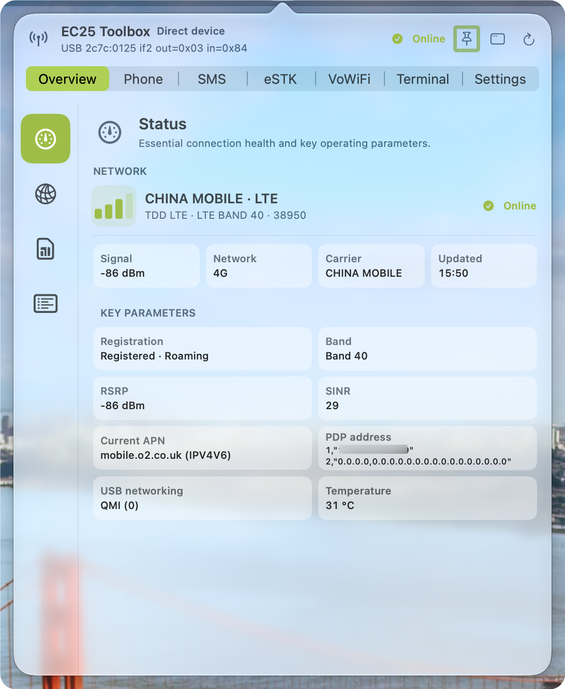

<p align="center">
  
</p>

<h1 align="center">EC25 Toolbox</h1>

<p align="center">
  
  
  
  
</p>

EC25 Toolbox is a native macOS menu bar utility for Quectel EC25, user-reconfigured first-generation DJI Cellular Dongle (LTE USB Modem) hardware, and compatible Baiwang USB modems. It communicates with the modem through IOKit and IOUSBHost, provides direct AT access, and combines cellular status, SMS, calling, SIM security, remote management, eUICC operations, and experimental VoWiFi support in one SwiftUI application.

The application bundle identifier is `ing.fuyaoskyrocket.ec25toolbox`.

> [!WARNING]
> **eSTK/eUICC and VoWiFi are experimental features.** They may fail, behave differently across modem firmware, eUICCs, SIMs, carriers, and access networks, or cause profile, message, configuration, or other data loss. This project makes no guarantee of their reliability, compatibility, availability, or data integrity. Back up critical data and make sure you have a carrier-supported recovery path before using either feature with an active subscription.

<p align="center">
  
</p>

## Highlights

- Automatically discovers EC25 devices with USB ID `2c7c:0125`.
- Supports compatible first-generation DJI Cellular Dongle units after they have been reconfigured outside the application to expose the expected EC25 USB identity and interfaces.
- Uses native IOKit and IOUSBHost bulk endpoints instead of an external serial-port dependency.
- Displays signal, carrier, registration, radio quality, SIM identity, modem identity, PDP, APN, and USB networking information.
- Reads, sends, deletes, and polls UCS2 SMS messages.
- Keeps SMS archives separated by eUICC EID and active profile ICCID.
- Maintains local SMS history with mergeable iCloud Drive backups.
- Manages SIM PIN locking, PIN changes, per-ICCID Keychain storage, and guarded automatic unlock.
- Starts voice calls with `ATD<number>;` and hangs up with `ATH`.
- Includes an AT terminal, APN configuration, network reselection, modem restart, and USB mode guidance.
- Supports direct-device and encrypted remote-management modes.
- Provides a native menu bar popover and an optional standalone macOS window.
- Builds and bundles a patched lpac 2.3.0 executable; no separate lpac installation is required.

## DJI Cellular Dongle Compatibility

EC25 Toolbox originally began as a way to reuse the LTE USB modem inside the first-generation [DJI Cellular Dongle (LTE USB Modem)](https://store.dji.com/uk/product/dji-cellular-dongle-lte-usb-modem). The Toolbox can communicate with a compatible unit after the user has reconfigured it outside the application to expose the Quectel EC25 USB vendor/product identity `2c7c:0125` and the expected EC25 USB interface composition.

EC25 Toolbox does not change the dongle's USB identity, firmware, or hardware configuration. A matching USB ID alone does not prove compatibility: the underlying modem firmware, USB composition, interface numbering, endpoints, and AT command behavior must also match what the native EC25 transport expects.

> [!IMPORTANT]
> This is a community hardware-reuse path, not an official DJI operating mode or a DJI-supported conversion. It applies only to compatible first-generation DJI Cellular Dongle (LTE USB Modem) units that have already been reconfigured by the user. DJI Cellular Dongle 2 has not been validated. Preserve the original device configuration and a recovery method before making hardware or firmware changes.

## Experimental Features

### eSTK and eUICC Management

The eSTK page uses the bundled lpac source through an ndJSON standard-I/O bridge and the modem's APDU channel. Depending on firmware support, EC25 Toolbox uses `AT+CCHO`/`AT+CGLA`/`AT+CCHC` logical-channel commands or falls back to `AT+CSIM`.

Implemented operations include:

- eUICC detection and chip information retrieval
- EID, EUICCInfo2, EUM, and CI inspection
- Profile listing, download, enable, disable, rename, and deletion
- Activation-code import from the clipboard or a QR-code image
- SM-DS discovery and default SM-DP+ management
- Notification processing and removal
- APDU and operation diagnostics with sensitive payload redaction
- Configurable APDU transport compatibility settings

These operations can modify or permanently remove eSIM profiles and notifications. Support varies substantially between removable eUICCs, modem firmware versions, bridges, and providers. A successful build or profile query does not prove that downloads, profile switching, notification processing, or recovery will be safe on a particular card.

### VoWiFi and IMS Messaging

The experimental VoWiFi implementation performs USIM/ISIM authentication, IKEv2/EAP-AKA negotiation, ESP NAT traversal, P-CSCF discovery, IMS registration, and IMS SMS processing inside EC25 Toolbox.

It is not macOS system Wi-Fi Calling, does not create a system VPN, and does not provide voice calling or emergency calling. Carrier provisioning, ePDG policy, access-network behavior, SIM contents, NAT traversal, and IMS security requirements can all prevent registration. Message delivery, acknowledgement, archival, and reconnect behavior are not guaranteed.

## Requirements

- macOS 26 or later
- Xcode containing the macOS 27 SDK
- Swift 6.2 or later
- A Quectel EC25, compatible Baiwang modem, or user-reconfigured first-generation DJI Cellular Dongle exposing USB ID `2c7c:0125` and the expected EC25 interfaces

Homebrew, Node.js, Electron, libusb, and a separately installed lpac executable are not required.

## Build and Test

Run commands from the repository root.

### Tests

```bash
DEVELOPER_DIR=/Applications/Xcode-beta.app/Contents/Developer \
/Applications/Xcode-beta.app/Contents/Developer/Toolchains/XcodeDefault.xctoolchain/usr/bin/swift test \
  --disable-sandbox \
  --sdk /Applications/Xcode-beta.app/Contents/Developer/Platforms/MacOSX.platform/Developer/SDKs/MacOSX27.0.sdk \
  -Xswiftc -plugin-path \
  -Xswiftc /Applications/Xcode-beta.app/Contents/Developer/Platforms/MacOSX.platform/Developer/usr/lib/swift/host/plugins
```

The bundled-lpac protocol test additionally requires `EC25_TEST_LPAC_PATH` to point to a compatible lpac executable.

### Package the Application

```bash
./Tools/package_swiftui.sh
```

The script builds the release executable, compiles the bundled lpac helper, copies localization and license resources, compiles the application icon, applies an ad hoc signature, and verifies the bundle. The result is written to:

```text
dist/EC25 Toolbox.app
```

The local package is ad hoc signed and is not notarized for public distribution.

### Generate Release Archives

After packaging the application:

```bash
swift Tools/ec25.swift release --no-build
```

Generated applications, archives, checksums, and other release artifacts belong in `dist/` and are intentionally excluded from Git.

## Architecture

```text
NSStatusItem / NSPopover / native NSWindow
                    |
              SwiftUI + ModemStore
                    |
        +-----------+-------------+
        |                         |
 direct EC25Transport      encrypted remote transport
        |
 IOKit / IOUSBHost bulk endpoints
        |
       EC25 ---- AT APDU transport ---- eUICC / ISIM / USIM
        |                                  |
        +---- lpac ndJSON APDU/HTTP -------+
        |
        +---- AKA ---- IKEv2/EAP-AKA ---- ESP NAT-T
                                                   |
                                            IMS SIP and SMS
```

`ModemStore` owns application state and serializes user operations. Feature-specific extensions reuse the same transport and busy/error pipeline instead of opening competing modem sessions.

## Data and Privacy

Local SMS data is stored at:

```text
~/Library/Application Support/EC25 Toolbox/Messages/messages-v1.json
```

When iCloud Drive is available, mergeable backups are stored under:

```text
iCloud Drive/EC25 Toolbox/Backups
```

Remote pairing keys and saved SIM PINs are stored in macOS Keychain. Activation data and raw bound-profile-package payloads are not written to the user-facing diagnostics log.

## Remote Management

A Mac connected directly to the modem can expose the encrypted management service on:

- port `48525` for RFC1918 local networks
- port `48526` for Tailscale `100.64.0.0/10` addresses

Requests use AES-256-GCM authenticated encryption with request-expiry and replay protection. The service does not intentionally bind to public Internet addresses. Rotating the direct-device pairing key revokes existing remote clients.

## Project Layout

```text
Package.swift                         SwiftPM package definition
Sources/EC25Toolbox/                  Main application and feature code
Sources/EC25IKEHelper/                Privileged IKE helper executable
Sources/EC25IKEHelperProtocol/        Helper protocol definitions
Sources/CVoWiFiCrypto/                C cryptographic bridge
Tests/EC25ToolboxTests/               XCTest and Swift Testing coverage
Resources/                            Info.plist, localizations, and app icon
ThirdParty/lpac/                      Vendored and patched lpac 2.3.0 source
ThirdParty/                           Additional upstream notices and licenses
Docs/                                 Feature and compatibility notes
Tools/package_swiftui.sh              Build, package, sign, and verify the app
Tools/ec25.swift                      Release archive helper
```

The vendored lpac source is based on commit `c2fcf5e4b21c712d54e35a11da2ad9ad134fb821` (`v2.3.0`). EC25-specific changes are documented in [`ThirdParty/lpac/EC25_PATCHES.md`](ThirdParty/lpac/EC25_PATCHES.md).

## Third-Party Components and References

- [lpac](https://github.com/estkme-group/lpac) provides the bundled LPA and eUICC implementation.
- [OpenEUICC](https://github.com/estkme-group/openeuicc) informs eUICC workflow and compatibility behavior.
- [EasyLPAC](https://github.com/creamlike1024/EasyLPAC) informs desktop eUICC metadata and interaction behavior.
- [ec25-manager](https://github.com/Nickspace114514/ec25-manager) provided early EC25 macOS management ideas.
- [vowifi-go](https://github.com/boa-z/vowifi-go) is a protocol implementation reference for parts of the experimental VoWiFi work.
- [vohive-collection](https://github.com/hzlmy2002/vohive-collection) is a VoWiFi and IMS research index.

Third-party source and data retain their respective upstream license terms. Review `ThirdParty/lpac/LICENSES`, `ThirdParty/lpac/REUSE.toml`, `ThirdParty/EasyLPAC-LICENSE`, and `ThirdParty/VoWiFi-NOTICE.md` before modifying or distributing the application.

## Safety and Limitations

- Use the project only with devices, subscriptions, networks, and accounts you are authorized to manage.
- Keep a carrier-supported recovery method before modifying eSIM profiles.
- Do not rely on the VoWiFi implementation for voice or emergency communications.
- USB networking mode changes can disconnect and re-enumerate the modem.
- Behavior varies by modem firmware, SIM/eUICC, carrier provisioning, macOS version, and access network.
- Build and automated-test success do not constitute hardware, carrier, eSIM-provider, or end-to-end VoWiFi validation.
